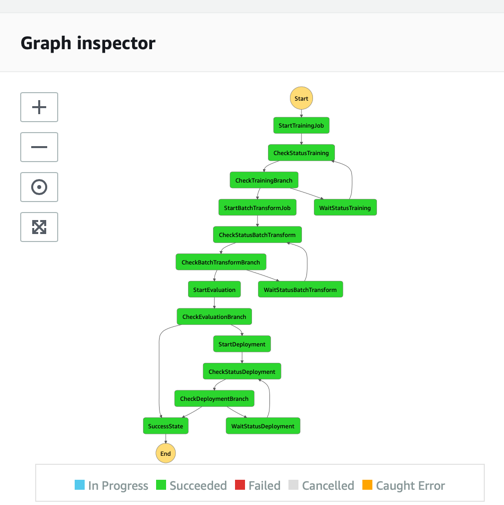
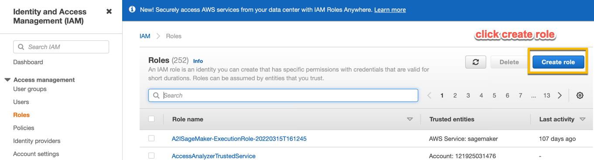
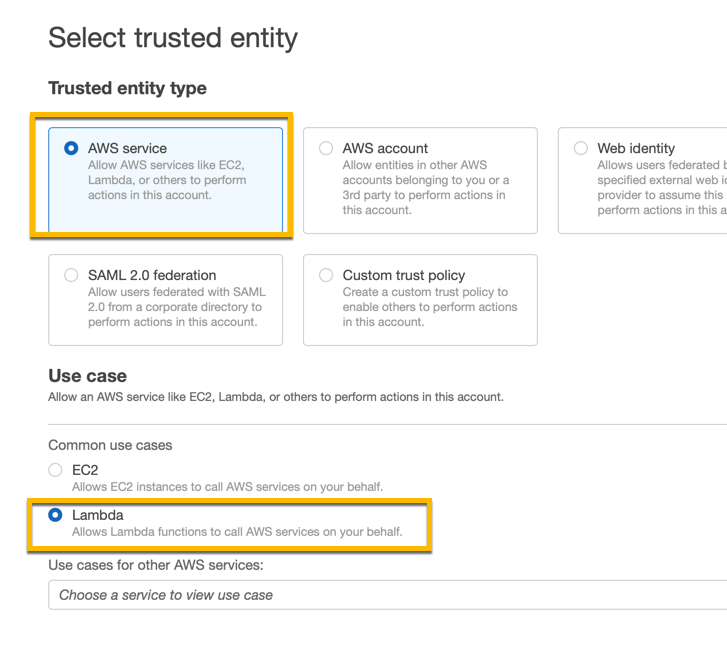
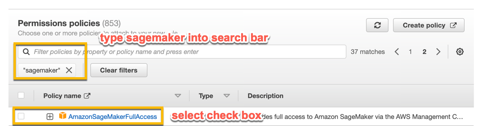
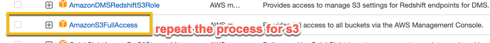
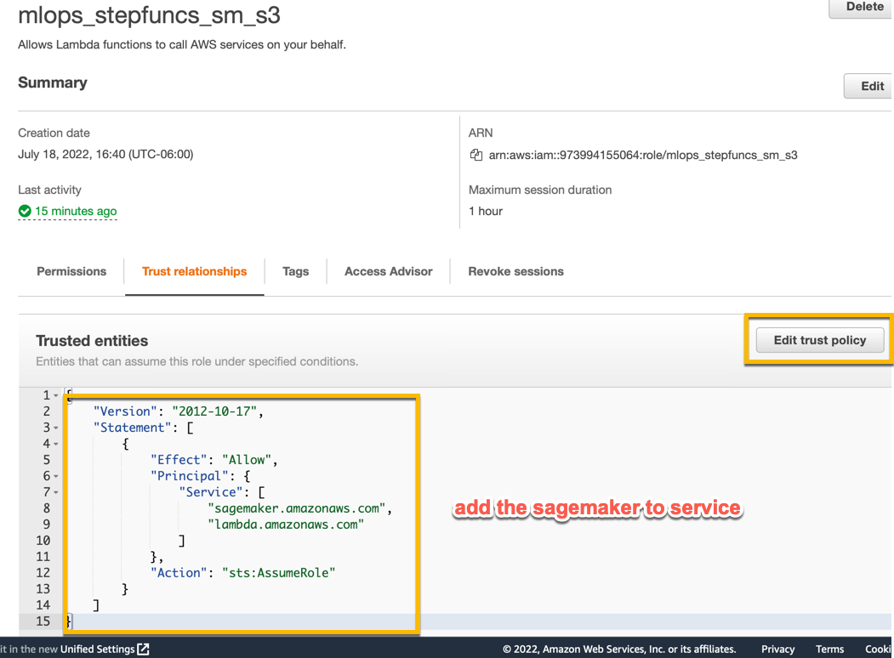
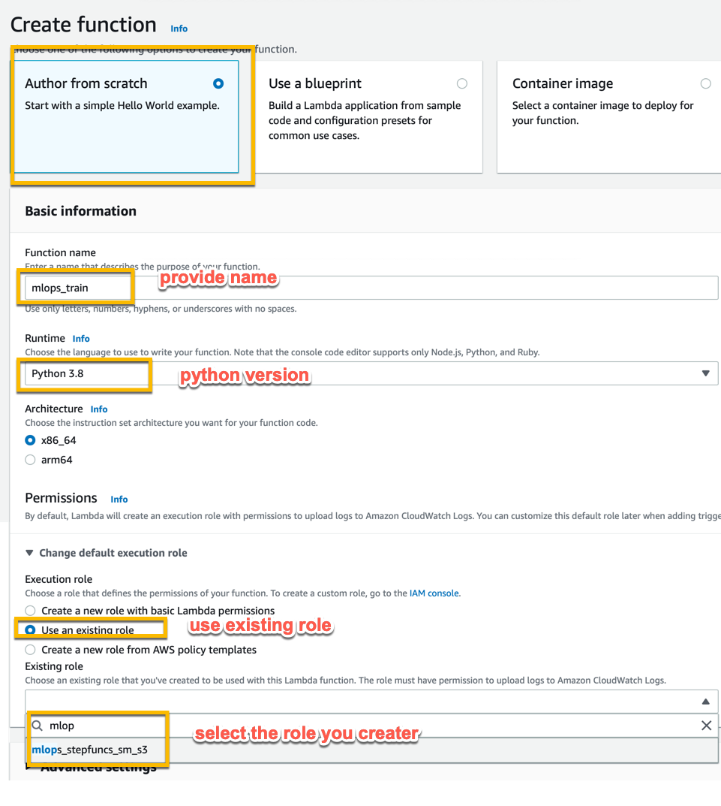
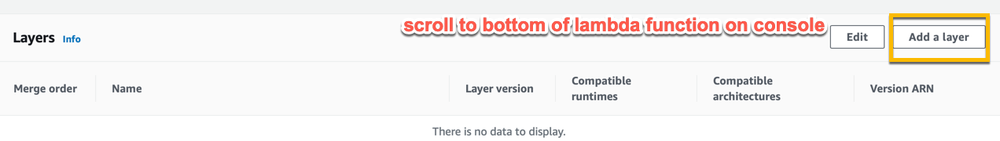
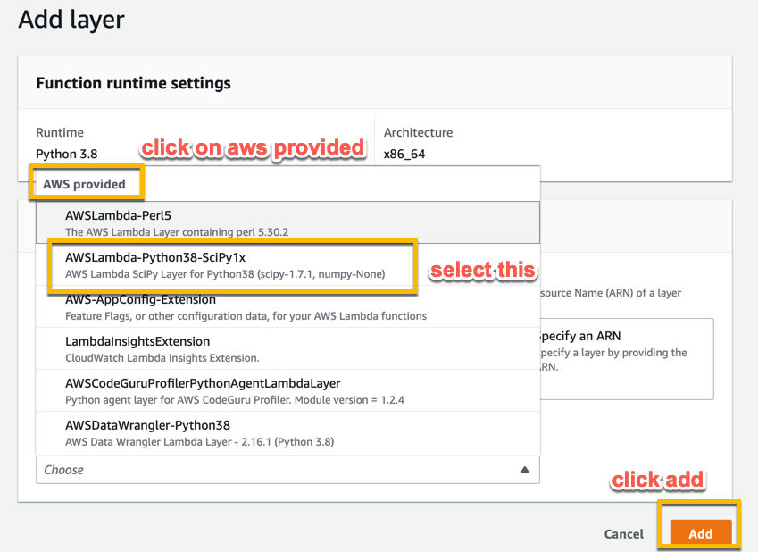
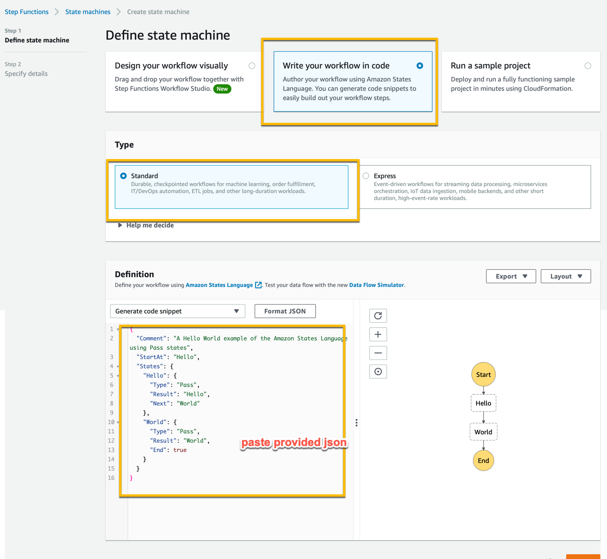

## MLOps with Native Lambdas and Step Functions

In this Tutorial you will learn how to set up step functions for very generic workflow in machine learning without any shortcuts.

AWS Stepfunctions Data Science SDK is limited in flexibility and so are SageMaker Pipelines. Here we will do it using lambda functions boto3 and step functions to orchestrate the flow and Use SageMaker Training, Batch Transform and Endpoints for ML processes.

.

## Build SageMaker Training and Inference Containers.

Follow the notebooks in the folders training-container and inference-container to build the training and inference containers respectively.

## IAM Role

Before we begin to create any lambda functions, let's first create IAM role lambdas will assume to access s3 and execute SageMaker training and inference.

From AWS Console, Type IAM in the search bar and navigate to the IAM Console, Click on create role 

.

Next select AWS Lambda and click next 

.

Search for SageMaker and S3 Full access polices and attach to the role

.

repeat the process for s3

.

Click Next, Name your role "mlops-sm-s3" and finish

From the IAM console, Search and find the role you just created and click on Trust Relationships, Edit the relationship and add in sagemaker.amazonaws.com

.

## Lambda Functions

We will lambda functions and interact with services such as s3 and Sagemaker using boto3 library.

Create five lambda functions by following the steps below naming each mlops_train, mlops_batch, mlops_await, mlops_eval and mlops_deploy

Ftom Lambda Console, Select the options as shown below and paste in the code from lambda-functions folder and corresponding to each name.

.

For the function mlops_eval , we want to use numpy library which is not natively supported by lambda functions, we will use AWS provided lambda layer which has numpy. Follow steps below by scrolling to the bottom of your lambda console for mlops_eval

.

in the next screen

.

Now, with containers created, lambdas and roles in place, we are ready to create and execute step functions

Go to Step Functions from AWS Console and click on create state machine and follow the instructions in the image below and paste in the contents of step function-definition.json

.

